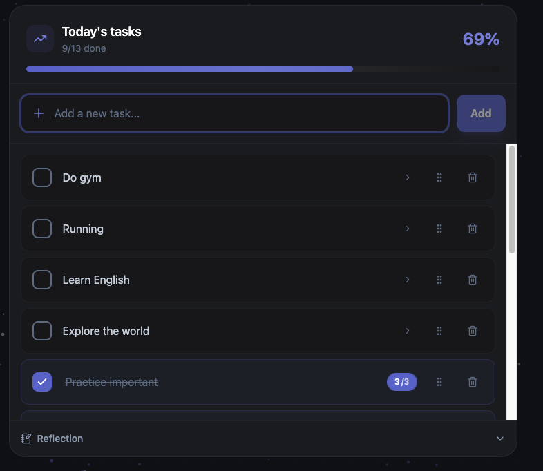

# Todo App

A daily productivity app: a per-day todo list that materializes from your templates,
week/month/year goals, daily reflection, a discipline (habit) tracker with streaks,
self-reviews with AI analysis, and full data export/import. Sign in with Google or a
username/password. English and Vietnamese.



## Features

- **Day todo** – Each day's list is built from your Default list, recurring templates,
  and date-specific templates, plus carry-over of yesterday's unfinished tasks. Progress
  bar, drag-to-reorder, sub-tasks.
- **Counters** – Type `Pull up x20` on any item or sub-task to track reps; tap the chip
  to count up, and it completes at the target. Works across every list.
- **Discipline (habits)** – Things you must do daily (get up early, no phone at work).
  Tick them for the day only; streaks, a 7-day strip on each row, and a 90-day heatmap.
  No back-filling, so the numbers stay honest.
- **Goals** – Week, month, and year goals with an optional template.
- **Reflection** – One-line journal, mood/energy, gratitude, and an "on this day" flashback.
- **Reviews** – Week/month self-reviews with history, plus optional Gemini AI analysis.
- **Notes** – People and things to remember.
- **Data export / import** – Download all your data as JSON and restore it (replace),
  from the Settings modal. Useful for backup and account migration.
- **Auth** – Google sign-in (open signup, new accounts approved by the admin over
  Telegram) alongside username/password.
- **i18n** – English and Vietnamese, switched in Settings.

## Tech Stack

- **Backend:** Bun, Express, TypeScript, MongoDB (Mongoose), JWT in an httpOnly cookie,
  Telegraf (admin bot), google-auth-library.
- **Frontend:** React 18, Vite, TypeScript, Tailwind CSS 4, Framer Motion, React Query,
  i18next, Google Identity Services.
- **Deploy:** Docker → GCP Cloud Run via GitHub Actions.

## Prerequisites

- [Bun](https://bun.sh) 1.2+
- MongoDB (Atlas or local)

## Quick Start

```bash
git clone git@github.com:Huygon764/TodoApp.git
cd TodoApp
bun run install:all      # installs backend + frontend
```

### Environment

Copy the examples and fill them in:

```bash
cp todo-backend/.env.example todo-backend/.env
cp todo-frontend/.env.example todo-frontend/.env   # optional, only for Google sign-in
```

Backend (`todo-backend/.env`) — see `todo-backend/.env.example` for the full list:

```env
NODE_ENV=development
PORT=5000
MONGODB_URI=mongodb://localhost:27017/todo-app
JWT_SECRET=your-secret-key
FRONTEND_URL=http://localhost:5173

# Optional: Google sign-in (public client id, not a secret)
GOOGLE_CLIENT_ID=your_client_id.apps.googleusercontent.com

# Optional: Telegram admin bot (user provisioning + signup approvals)
TELEGRAM_BOT_TOKEN=
TELEGRAM_CHAT_ID=

# Optional: Gemini AI for review analysis
GEMINI_API_KEY=
```

Frontend (`todo-frontend/.env`) — only for Google sign-in. The **same** client id, with the
`VITE_` prefix so Vite inlines it at build:

```env
VITE_GOOGLE_CLIENT_ID=your_client_id.apps.googleusercontent.com
```

### Run

```bash
bun run dev          # backend + frontend together
# or: bun run dev:back / bun run dev:front
```

- Frontend: http://localhost:5173
- Backend: http://localhost:5000

Other scripts: `bun run build` (typecheck backend + build frontend), `bun run typecheck`.

## Google sign-in (optional)

1. Google Cloud Console → **Google Auth Platform**: configure the consent screen
   (External), add your email as a test user.
2. **Clients → Create client → Web application**. Authorized JavaScript origins:
   `http://localhost:5173` and your production URL. Leave redirect URIs empty (the app
   uses the Google Identity Services ID-token flow — no client secret needed).
3. Put the client id in both env files as shown above and restart.

New Google users are created pending; the admin approves them from Telegram
(Approve/Deny buttons, or `/pending`, `/approve <email>`, `/deny <email>`). Username and
password login still works.

## Deploy

`main` pushes trigger `.github/workflows/deploy.yml`: typecheck both apps, build the Docker
image, and deploy to Cloud Run. Secrets come from GCP Secret Manager; plain config
(including `GOOGLE_CLIENT_ID` and the build-time `VITE_GOOGLE_CLIENT_ID`) comes from GitHub
repo variables.
